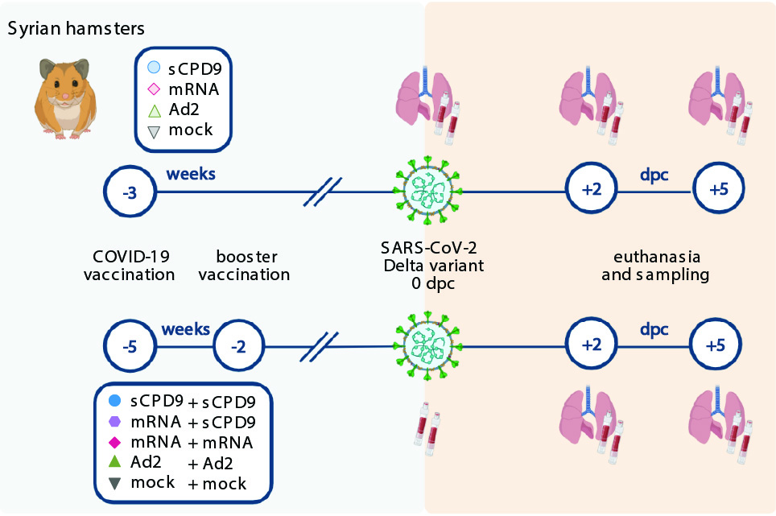

# Live attenuated vaccine strategy confers superior mucosal and systemic immunity to SARS-CoV-2
This is the code for the preprint available at https://www.biorxiv.org/content/10.1101/2022.05.16.492138v1

## Experimental setup

Bulk and single-cell transcriptomics was performed at 2 dpi. The first experiment ("exp1…") is the one in the upper part of the image above, with only one vaccination. The second experiment ("exp2…") is the prime-boost scheme (lower part). This repository contains the code used for the generation of the figures in the preprint linked above. Raw fastq files are available at NCBI GEO, accession number GSE200596 (https://www.ncbi.nlm.nih.gov/geo/query/acc.cgi?acc=GSE200596). The blood samples from the first experiment were of very poor quality and not processed further. 

The libraries were generated using the cellplex kit from 10x genomics. Processing was done as following.

Step 1 - For demultiplexing, cellranger multi was run, using the multiconfig csv files in folder Step1_multiconfig_csv_files.

Step 2 - The samples are combined and converted to a Seurat object using the scripts in folder Step2_combining_samples. At this step, a very low quality threshold of 250 genes per cell is applied. Also doublets are defined (not used in downstream analysis).

Step 3 - The cell types in the combined object are annotated, either as specific types or "mixedX". A nUMI threshold per cell type is then used to generate a list of cells to be retained (see scripts in folder Step3_filtering_samples)

Step 4 - After filtering, samples are processed using the SCT/integrate workflow, see folder Step4_filter_integrate.

Step 5 - Cell types are again annotated, yielding the Seurat objects used for the analysis in the preprint (folder Step5_annotate). These objects are also available on GEO (https://www.ncbi.nlm.nih.gov/geo/query/acc.cgi?acc=GSE200596).

For the analysis in figure 4 I-K (folder Fig4IJK_and_S15), T cells from lung samples from experiment 2 were extracted from the respective Seurat object. For the other plots in the manuscript, see the respective folders.
